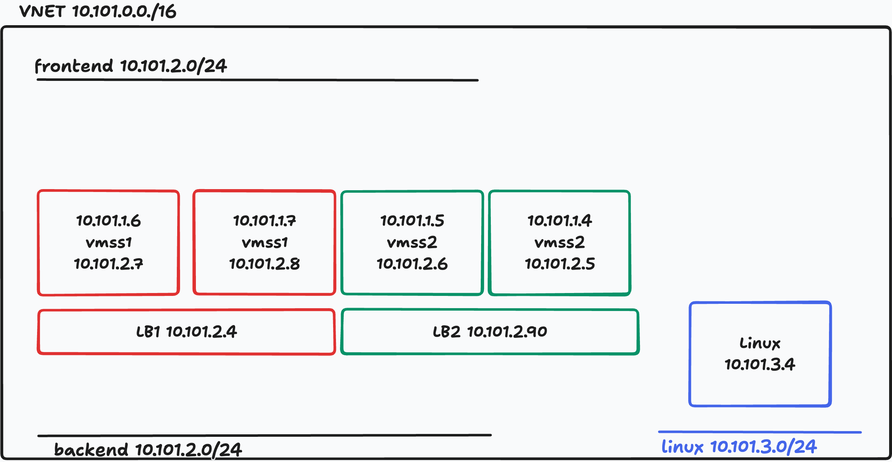

## Azure

Lab is depending on *dedicated Azure Service Principal* with Owner role on subscription level. This is created by user manually in advance in [Azure Shell](https://shell.azure.com/).

Open [Azure Shell](https://shell.azure.com/) and run following command to obtain istructions what to do back in your CodeSpace/DevContainer terminal:

```bash
# inspect what will be done
curl -sL https://run.klaud.online/labspx.sh
# run it now IN AZURE SHELL
bash <(curl -sL https://run.klaud.online/labspx.sh)
```

This returned sequence of commands that should be run in your CodeSpace/DevContainer terminal similar to this:

```bash
    # example only - USE REAL OUTPUT FROM AZURE SHELL
    touch .env

    dotenvx set TF_VAR_envId "356e0a0d"
    dotenvx set TF_VAR_subscriptionId 00000000-0000-4000-8000-000000000000
    dotenvx set TF_VAR_tenant 11111111-1111-4111-8111-111111111111
    dotenvx set TF_VAR_appId 22222222-2222-4222-8222-222222222222
    dotenvx set TF_VAR_password "USEpLz1#qT9eWmKYOUR-OWN-SECRETrJgZxAo!sVdChEt"
    dotenvx set TF_VAR_displayName "sp-automagic-356e0a0d"

    # verify stored secrets in the root of your repository
    dotenvx run -- env | grep TF_VAR_
```

This produced `.env` file is used by Terraform and other automation tools to authenticate in Azure and manage resources.
There is also unique environment ID used to tag and name resources created in Azure.

Login to Azure with your new Azure Service Principal:

```bash
az login --service-principal -u $(dotenvx get TF_VAR_appId) -p $(dotenvx get TF_VAR_password) --tenant $(dotenvx get TF_VAR_tenant)
az account set --subscription $(dotenvx get TF_VAR_subscriptionId)
az account show -o table

# or simply BETTER use prepared scripts
make sp-login
```

## VMSS Upgrade scenario

